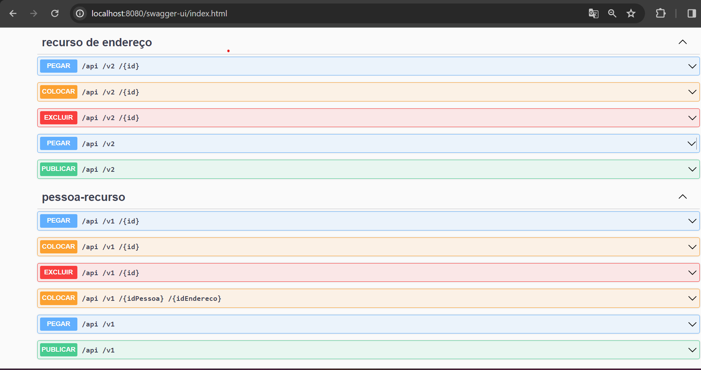

# Sistema de Cadastro IBGE
[](https://github.com/jvmaiaa/APLICACAO_IBGE/edit/main/LICENSE)
# Sobre o projeto

Este é um projeto que desenvolvi com a finalidade de aprofundar meus conhecimentos com o uso de **Java** com **Spring Framework**. Pode-se perceber algumas melhoras desde o primeiro commit até o commit atual, e ainda com possíveis pontos que possam ser melhorados. Sinta-se à vontade para deixar sua contribuição e opinião no projeto, caso queira, pode entrar em contato por alguma das minhas redes sociais disponíveis.

A aplicação consiste em um sistema de cadastro de **Endereços** e **Famílias**, tal que, 1 pessoa só possui 1 endereço, e 1 endereço pode possuir N pessoas. Em alguns casos específicos eu implementei algumas validações, que caso não sejam satisfeitas, podem realizar algumas exceções, com isso, tive a obrigação de fazer o tratamento de muitos comportamentos da aplicação.

## Endpoints disponíveis
Para vizualizar todos os endpoints disponíveis da aplicação com mais detalhes, acesse:
- Vale ressaltar que você precisa **executar a aplicação antes.**
- `http://localhost:8080/swagger-ui/index.html`
Implementação de decumentação feita com `Swagger`.


# Tecnologias utilizadas
## Back end
- Java
- Spring Boot
- JPA / Hibernate
- Maven
- Lombok
## Banco de Dados
- Banco de dados: MySQL
- Nome do banco que deve ser criado no seu db: pessoa
- Caso queira utilizar o banco de dados em memória, comente as configurações atuais do `application.properties` e descomente a parte que faz referência ao banco de dados em memória
- É possível comentar/descomentar um trecho de código selecionado no intelliJ IDEA utilizando o atalho `Ctrl + /`
```java
## H2
#spring.datasource.url=jdbc:h2:mem:testdb
#spring.datasource.driverClassName=org.h2.Driver
#spring.datasource.username=sa
#spring.datasource.password=
#spring.h2.console.enabled=true
#spring.h2.console.path=/h2-console
```
# Como executar o projeto
## Back end
Pré-requisitos: Java 17
```bash
# clonar repositório
git clone https://github.com/jvmaiaa/APLICACAO_IBGE.git)
# utilize alguma IDE para rodar o projeto com IntelliJ IDEA
execute a aplicação pelo método main

# Autor
João Víctor Maia
https://www.linkedin.com/in/joão-víctor-maia-4b9961265/

